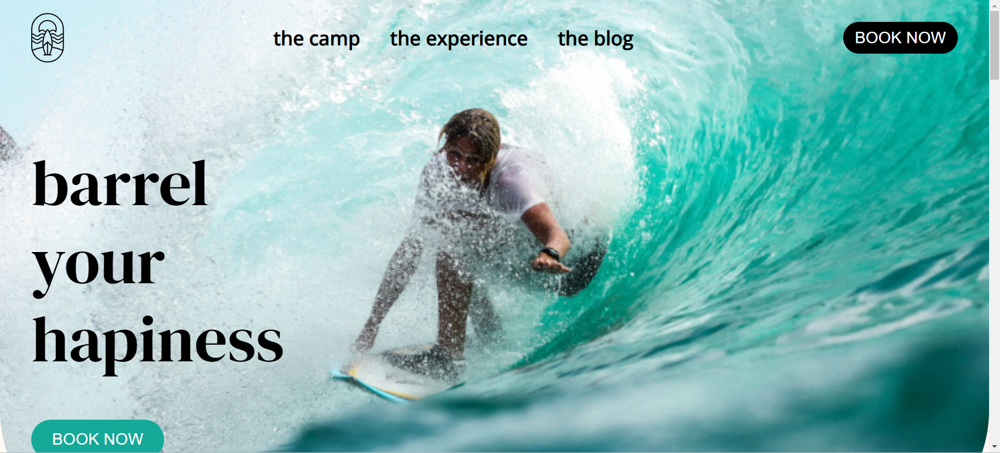
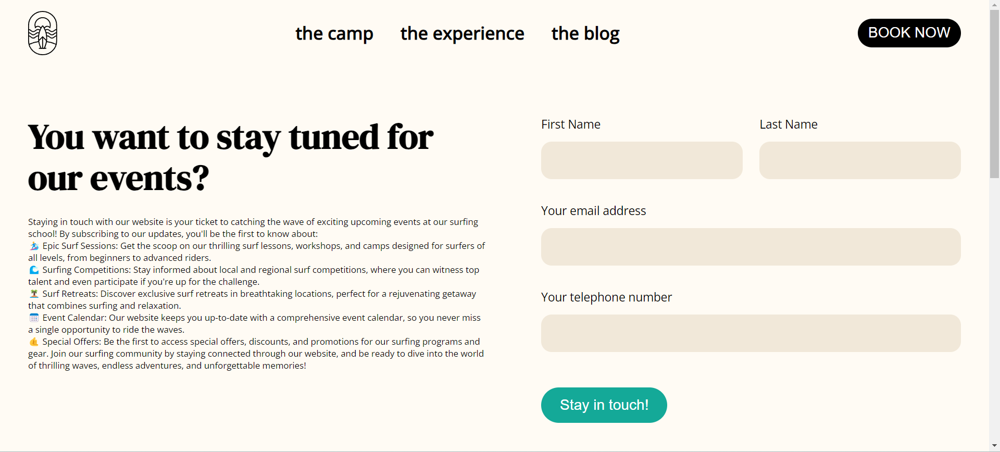
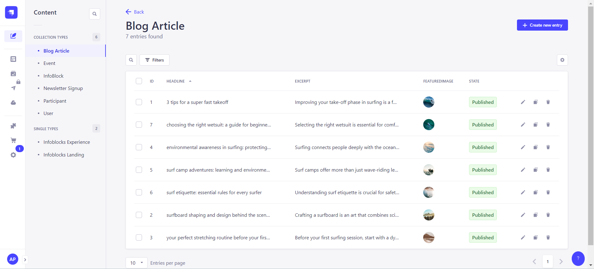

## SURF CAMP BLOG

### A blog about surf camps around the world

## Technologies

- Next.js
- React
- Scrapi
- Sass

## Installation

1.  Clone the repository

        ```bash
        git clone https://github.com/andresito87/Surf-Camp-Blog.git
        ```

2.  Install the dependencies

    ```bash
    cd surfcamp_frontend
    npm install
    cd surfcamp_strapi
    npm install
    ```

3.  Run the development DB and backend API in Strapi

    ```bash
    cd surfcamp_strapi
    npm run develop
    ```

4.  Run the development server

    ```bash
    cd surfcamp_frontend
    npm run dev
    ```

5.  Open [http://localhost:3000](http://localhost:3000) with your browser to see the result.

## Images of App





## Authors

- [Andrés Samuel Podadera González](https://www.linkedin.com/in/andresito87/){:target="\_blank"}

## References

- [The Freelance Stack: Real project with NextJS and Strapi](https://learning.oreilly.com/course/the-freelance-stack/9781835465462/){:target="\_blank"}

## License

MIT
